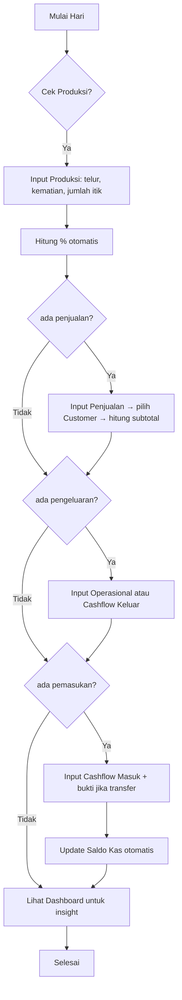
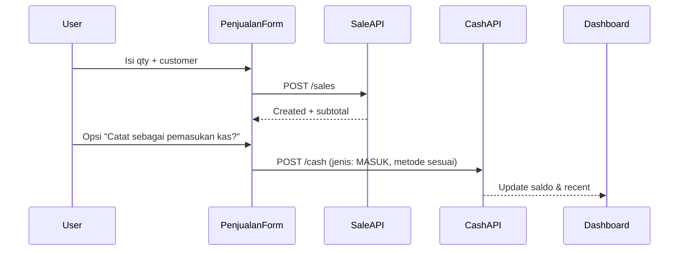

# Spesifikasi Aplikasi Web: Manajemen Peternakan Itik

**Versi:** 1.0  
**Tanggal:** 2026-07-07  
**Tujuan:** Memberikan requirements lengkap, alur proses (flows), model data, dan gambaran UI detail untuk aplikasi web manajemen peternakan itik (bebek petelur).  
**Status:** Siap untuk implementasi

---

## 1. Ringkasan Proyek & Tujuan

Aplikasi web sederhana namun powerful untuk pemilik peternakan itik skala kecil-menengah di Indonesia.

**Fitur Inti (sesuai permintaan):**
- **Dashboard** sebagai ringkasan & statistik utama
- Input & manajemen:
  - Data Penjualan (telur + relasi Customer)
  - Data Produksi harian
  - Cashflow / Arus Kas (dengan bukti pembayaran)
  - Data Operasional (biaya & pemakaian)
  - Master Data Pelanggan (Customer)

**Manfaat Utama:**
- Pantau performa produksi & kesehatan ternak secara real-time
- Kontrol keuangan (penjualan, pengeluaran, saldo kas)
- Catat transaksi dengan bukti untuk akuntansi sederhana
- Laporan & insight untuk pengambilan keputusan

---

## 2. Requirements

### 2.1 Functional Requirements

#### Dashboard Utama
| ID | Requirement | Acceptance Criteria |
|----|-------------|---------------------|
| D-01 | Tampilkan KPI ringkasan | Menampilkan: Jumlah itik saat ini, Telur diproduksi hari ini, Telur terjual bulan ini, Pendapatan bulan ini (Rp), Saldo kas saat ini, Rata-rata persentase produksi, Jumlah kematian bulan ini |
| D-02 | Grafik tren | Line chart produksi telur 30 hari terakhir + Bar chart pendapatan vs pengeluaran 30 hari |
| D-03 | Breakdown pengeluaran | Pie chart operasional berdasarkan kategori (7 hari / 30 hari) |
| D-04 | Quick actions | Tombol cepat: + Penjualan, + Produksi, + Cashflow, + Operasional |
| D-05 | Ringkasan terkini | Tabel 5 transaksi cashflow & 5 penjualan terbaru |

#### Data Penjualan
| ID | Requirement | AC |
|----|-------------|----|
| S-01 | CRUD Penjualan | Create, Read (tabel + detail), Update, Delete |
| S-02 | Field wajib | Tanggal, Item (default: "Telur Itik"), Harga Satuan (Rp), Qty (butir), Subtotal (otomatis), Customer (dropdown / search) |
| S-03 | Relasi Customer | Wajib pilih customer yang sudah ada atau quick-add customer baru dari form |
| S-04 | Validasi | Harga satuan & qty > 0. Subtotal = harga × qty |
| S-05 | Filter & search | Filter tanggal (range), search customer, sort by date/qty/total |
| S-06 | Export | Export tabel ke CSV |

#### Data Produksi
| ID | Requirement | AC |
|----|-------------|----|
| P-01 | Input harian | Satu record per tanggal (unique constraint) |
| P-02 | Field | Tanggal, Jumlah Itik (ekor), Jumlah Telur (butir), Jumlah Kematian (ekor hari itu), Persentase Produksi (otomatis) |
| P-03 | Perhitungan | `persentase = (jumlah_telur / jumlah_itik) * 100` (jika jumlah_itik = 0 tampilkan N/A atau 0) |
| P-04 | Update flock | Kematian mengurangi jumlah itik untuk hari-hari berikutnya (atau simpan snapshot jumlah itik per hari) |
| P-05 | Riwayat & tren | Tabel + grafik garis produksi & persentase |

#### Data Cashflow / Arus Kas
| ID | Requirement | AC |
|----|-------------|----|
| C-01 | Transaksi | Tanggal, Keterangan, Jenis (Uang Masuk / Uang Keluar), Nominal (Rp), Metode (Cash / Transfer), Upload Bukti (opsional untuk cash, wajib/rekomendasi untuk transfer) |
| C-02 | Saldo berjalan | `sisa_saldo` dihitung secara kumulatif (bisa dihitung di backend atau client). Tampilkan di setiap baris dan ringkasan |
| C-03 | Bukti transfer | Upload file (jpg/png/pdf). Preview thumbnail + link download. Simpan path/url |
| C-04 | Filter | By date range, jenis, metode bayar |
| C-05 | Ringkasan | Total masuk, total keluar, saldo akhir periode |

#### Data Operasional
| ID | Requirement | AC |
|----|-------------|----|
| O-01 | Kategori tetap | Enum: `pakan`, `vitamin`, `obat-obatan`, `listrik`, `air` |
| O-02 | Field | Tanggal, Kategori, Harga Nominal (Rp), Qty, Satuan (otomatis berdasarkan kategori: pakan/vitamin/obat → kg atau gr; listrik/air → bulan/kWh atau m³) |
| O-03 | Total biaya | Bisa dihitung qty × harga jika relevan, atau simpan sebagai biaya total |
| O-04 | List & filter | Per kategori + rentang tanggal. Ringkasan bulanan |

#### Data Customer / Pelanggan
| ID | Requirement | AC |
|----|-------------|----|
| CU-01 | Master data | Nama (wajib), Kontak (HP/WA, opsional email/alamat) |
| CU-02 | Relasi | Digunakan di Penjualan. Tidak boleh dihapus jika sudah ada transaksi (soft delete atau cegah) |
| CU-03 | CRUD sederhana | List, tambah cepat dari form penjualan, edit, hapus (jika aman) |

### 2.2 Non-Functional Requirements
- **Responsif**: Mobile-first (sidebar collapse, tabel horizontal scroll atau card view di mobile)
- **Performa**: Dashboard load < 1.5s dengan data 1 tahun
- **Keamanan**: Validasi server-side, sanitasi input, auth dasar. File upload dibatasi ukuran & tipe
- **Bahasa & Lokal**: Seluruh UI dalam Bahasa Indonesia. Format Rupiah (Rp 1.250.000), tanggal DD MMM YYYY atau sesuai locale
- **Data Integrity**: Unik tanggal di Produksi. Running balance cashflow konsisten
- **Offline / Backup**: (MVP) Export semua data ke CSV/JSON. Backup manual
- **Aksesibilitas**: Label form yang benar, kontras cukup, keyboard navigable

---

## 3. Model Data & Skema

### 3.1 Entity Relationship (Mermaid)

```mermaid
erDiagram
    CUSTOMER ||--o{ SALE : "membeli"
    SALE ||--o| CUSTOMER : ""
    PRODUCTION {
        date PK "YYYY-MM-DD"
        jumlah_itik int
        telur_diproduksi int
        kematian int
        persentase_produksi decimal
    }
    CASH_TRANSACTION {
        id PK
        tanggal date
        keterangan string
        jenis "MASUK | KELUAR"
        nominal decimal
        metode "CASH | TRANSFER"
        bukti_url string
        saldo_setelah decimal
    }
    OPERATIONAL_EXPENSE {
        id PK
        tanggal date
        kategori "PAKAN | VITAMIN | OBAT | LISTRIK | AIR"
        harga_nominal decimal
        qty decimal
        satuan string
        total_biaya decimal
    }
    SALE {
        id PK
        tanggal date
        item string "Telur Itik"
        harga_satuan decimal
        qty int
        subtotal decimal
        customer_id FK
    }
    CUSTOMER {
        id PK
        nama string
        kontak string
    }
```

### 3.2 Prisma Schema (Contoh)

```prisma
model Customer {
  id        Int     @id @default(autoincrement())
  nama      String
  kontak    String?
  sales     Sale[]
  createdAt DateTime @default(now())
}

model Sale {
  id           Int      @id @default(autoincrement())
  tanggal      DateTime
  item         String   @default("Telur Itik")
  hargaSatuan  Decimal
  qty          Int
  subtotal     Decimal
  customer     Customer @relation(fields: [customerId], references: [id])
  customerId   Int
  createdAt    DateTime @default(now())
}

model Production {
  tanggal            DateTime @id
  jumlahItik         Int
  telurDiproduksi    Int
  kematian           Int      @default(0)
  persentaseProduksi Decimal?
}

model CashTransaction {
  id           Int      @id @default(autoincrement())
  tanggal      DateTime
  keterangan   String
  jenis        String   // "MASUK" | "KELUAR"
  nominal      Decimal
  metode       String   // "CASH" | "TRANSFER"
  buktiUrl     String?
  saldoSetelah Decimal? // opsional (bisa dihitung)
  createdAt    DateTime @default(now())
}

model OperationalExpense {
  id           Int      @id @default(autoincrement())
  tanggal      DateTime
  kategori     String   // enum
  hargaNominal Decimal
  qty          Decimal
  satuan       String
  totalBiaya   Decimal?
  createdAt    DateTime @default(now())
}
```

**Catatan flock size**: 
- Gunakan snapshot `jumlahItik` pada Production setiap hari, atau hitung dari initial + purchase - cumulative death.
- Rekomendasi MVP: snapshot manual setiap hari.

---

## 4. Alur Proses & User Flows (Mermaid)

### 4.1 Alur Harian Utama



### 4.2 Flow Penjualan → Cashflow



### 4.3 Lainnya
- Cash reconciliation bulanan
- Review kematian & produksi rendah

---

## 5. Arsitektur Informasi & Navigasi

**Layout Global (Next.js App Router):**
- Sidebar kiri (fixed di desktop, hamburger di mobile)
- Top bar: Logo + Nama Peternakan + Tanggal hari ini + User (avatar)
- Main content area

**Menu Sidebar:**
- Dashboard
- Penjualan
- Produksi
- Arus Kas
- Operasional
- Pelanggan
- (Opsional) Laporan / Export

---

## 6. Spesifikasi UI & Gambaran Layar

**Stack Visual & Style (dari pola proyek lokal):**
- shadcn/ui + Tailwind
- Lucide icons
- Recharts untuk grafik
- Card dengan subtle border & hover lift
- Warna: 
  - Primary: emerald-600 / teal-700 (alam)
  - Accent: amber-500
  - Netral: slate
  - Background: clean white / zinc-50
- Font: Inter / system sans

### 6.1 Dashboard (Halaman Utama)

**Wireframe (ASCII / Layout):**

```
┌────────────────────────────────────────────────────────────┐
│ [Logo] Peternakan Itik Maju     07 Juli 2026   [User]      │
├──────────────┬─────────────────────────────────────────────┤
│ Dashboard    │                                             │
│ Penjualan    │  ┌────────┐ ┌────────┐ ┌────────┐ ┌────────┐│
│ Produksi     │  │ 248    │ │ 1.240  │ │ Rp 8.4M│ │ Rp 2.1M││
│ Arus Kas     │  │ Itik   │ │ Telur  │ │Revenue │ │ Saldo  ││
│ Operasional  │  │        │ │ Bulan  │ │MTD     │ │ Kas    ││
│ Pelanggan    │  └────────┘ └────────┘ └────────┘ └────────┘│
│              │                                             │
│              │  [Quick Actions: +Penjualan +Produksi ...]  │
│              │                                             │
│              │  ┌────────────────────────────┐             │
│              │  │ Produksi 30 hari (Line)    │             │
│              │  └────────────────────────────┘             │
│              │  ┌──────────────┐  ┌──────────────────────┐ │
│              │  │ Recent Sales │  │ Cashflow Terbaru     │ │
│              │  └──────────────┘  └──────────────────────┘ │
└──────────────┴─────────────────────────────────────────────┘
```

**Komponen Kunci:**
- 4-6 StatCard (dengan ikon lucide, warna berbeda)
- 2 Chart besar (Recharts ResponsiveContainer)
- 2 mini tables
- Empty state jika belum ada data

### 6.2 Halaman Penjualan

- Toolbar: Tombol "+ Tambah Penjualan" + Date Range Picker + Search + Export CSV
- Tabel kolom: Tanggal | Customer | Qty (butir) | Harga Sat | Subtotal | Aksi (edit/delete)
- Modal / Sheet form:
  - Date picker
  - Customer: combobox searchable + "Tambah Baru"
  - Harga Satuan (number, format Rp)
  - Qty
  - Subtotal (read-only, computed live)
- Validasi realtime dengan Zod

**Contoh Baris Tabel:**
| 05 Jul 2026 | Pak Budi | 120 butir | Rp 2.800 | Rp 336.000 | [Edit] [Hapus] |

### 6.3 Halaman Produksi

- Kalender view sederhana atau tabel tanggal
- Form cepat (bisa inline atau modal):
  - Tanggal
  - Jumlah Itik saat ini
  - Telur diproduksi
  - Kematian
  - % Produksi = otomatis (readonly atau live)
- Grafik tren produksi + persentase
- Indikator warna: hijau (>70%), kuning, merah (<50%)

### 6.4 Halaman Arus Kas (Cashflow)

**Paling kompleks:**
- Ringkasan atas: Total Masuk | Total Keluar | Saldo Akhir
- Tabel:
  | Tanggal | Keterangan | Jenis | Nominal | Saldo | Metode | Bukti | Aksi |
- Form:
  - Semua field + dropzone / button upload bukti (preview)
  - Jenis transaksi radio / select (masuk/keluar)
  - Jika TRANSFER, highlight "Unggah bukti"
- Bukti: thumbnail kecil, klik untuk full view modal

### 6.5 Halaman Operasional

- Filter kategori (chips atau multi-select)
- Tabel + ringkasan total per kategori
- Form sederhana dengan select kategori yang mengubah helper text satuan

### 6.6 Halaman Pelanggan

- Tabel sederhana
- Modal tambah/edit: Nama + Kontak (WA lebih diutamakan)
- Stat mini: "Total pembelian" (bisa dihitung dari sales)

---

## 7. Contoh Data & Edge Case

**Sample Customer:**
- Pak Budi Santoso — 08123456789
- Bu Siti — 08567890123

**Sample Production:**
- 2026-07-06 | 250 itik | 185 telur | 2 mati | 74%

**Sample Sale:**
- 2026-07-05 | Telur Itik | 2800 | 150 | 420.000 | Pak Budi

**Edge Cases:**
- Jumlah itik = 0 → persentase = "-"
- Penjualan pertama sebelum ada customer
- Cashflow tanpa bukti (cash)
- Hapus customer yang punya histori → blokir atau pindah ke "Umum"
- Multiple transaksi di hari yang sama

---

## 8. Rekomendasi Teknologi (Next.js + Payload CMS)

**Stack yang dipilih:**
- **Full-stack Framework**: Next.js 15 (App Router) + TypeScript
- **Backend + Admin UI**: **Payload CMS 3+** (Next.js native)
- **UI & Components**: Tailwind + shadcn/ui (untuk custom dashboard)
- **Charts & Visualisasi**: Recharts
- **Form**: React Hook Form + Zod (untuk custom forms jika diperlukan)
- **Database**:
  - **PostgreSQL** (paling direkomendasikan) — Neon, Railway, Supabase, atau lokal. Lebih matang untuk relasi, transaksi, dan perhitungan keuangan.
  - **Cloudflare D1** (opsi menarik) — SQLite serverless. Bagus kalau mau full-stack di Cloudflare (Workers + D1 + R2). Ada template resmi Payload. Lebih murah & global, tapi ada keterbatasan transaksi & skalabilitas.
- **File Upload (Bukti Transfer)**: Payload Uploads (Media collection) — built-in
- **Auth**: Payload built-in auth (Users collection)
- **Utilitas**: date-fns, lucide-react, sonner

### Kenapa Next.js + Payload CMS Cocok untuk Project Ini?

**Kelebihan:**
- **Admin panel otomatis yang sangat powerful** di `/admin` — langsung bisa dipakai untuk input Penjualan, Produksi, Cashflow, Operasional, dan Pelanggan.
- Relationship antar collection (misalnya Sale ↔ Customer) ditangani secara native.
- Upload file (bukti transfer) sudah built-in dan bagus.
- Satu codebase (Next.js + Payload).
- Local API sangat cepat untuk membangun custom Dashboard cantik di Next.js (bisa query data tanpa HTTP).
- TypeScript-first, sangat maintainable.
- Mudah ditambah fitur nanti (hooks untuk hitung otomatis saldo/persentase, access control, dll).

**Pendekatan yang direkomendasikan:**
- Gunakan **Payload Admin** (`/admin`) untuk data entry (cepat & lengkap).
- Bangun **custom Dashboard** yang ramah peternak di halaman utama (`/`) menggunakan Next.js Server Components + Recharts + shadcn.
- Bisa hybrid: admin untuk staff, dashboard cantik untuk owner.

**Catatan:**
- Tidak perlu Prisma lagi (Payload mengelola schema & migrations).
- Database: PostgreSQL (bukan Mongo untuk production).

**Pola UI yang bisa direuse:**
- Stat cards & layout dari proyek seperti alqoswah-dashboard
- shadcn/ui components + Recharts untuk grafik custom dashboard
- Payload akan handle tabel & form di admin secara otomatis

### Mapping Fitur ke Payload Collections

| Fitur di Spesifikasi       | Nama Collection di Payload      | Fitur Payload yang Dipakai                  |
|---------------------------|----------------------------------|---------------------------------------------|
| Data Customer             | `customers`                     | Text fields, simple                       |
| Data Penjualan            | `sales`                         | Relationship ke customers, number fields, date |
| Data Produksi             | `productions`                   | Date (unique), numbers, hook untuk %     |
| Cashflow + Bukti          | `cashTransactions`              | Select (jenis, metode), Upload field     |
| Data Operasional          | `operationalExpenses`           | Select kategori, number + qty             |

**Contoh struktur collection** (akan dibuat di `src/collections/`):

Lihat contoh lengkap di bagian bawah dokumen ini atau di file konfigurasi proyek.

---

## 9. Roadmap Implementasi (Disarankan)

**Fase 1 (Selesai)**
- ✅ Scaffold Next.js 16 + Payload CMS 3
- ✅ Setup collections lengkap termasuk **Users** (dengan auth)
- ✅ Custom Dashboard cantik di `/` dengan statistik, grafik Recharts, recent activity
- ✅ Seed data script + tombol dev
- ✅ Admin panel di `/admin` dengan autentikasi Payload yang rapi
- Setup PostgreSQL via DATABASE_URI

**Fase 2**
- Relasi Customer + Penjualan
- Cashflow lengkap + upload bukti
- Operasional
- Filter & export

**Fase 3**
- Dashboard interaktif penuh
- Laporan sederhana
- UI polish + responsive
- Auth dasar

**Fase 4 (Opsional)**
- Mobile PWA
- Notifikasi WA harian
- Multi-tenant / multi peternakan

---

## 10. Cara Menggunakan Spesifikasi Ini

1. Gunakan sebagai acuan utama saat coding
2. Mulai dengan collections Payload + seed data contoh
3. Implementasi UI mengikuti wireframe + komponen yang disebutkan
4. Setiap halaman harus memiliki:
   - Loading state
   - Empty state
   - Error handling
   - Form validation

---

## 11. Pertanyaan Terbuka

- Apakah jumlah itik di Produksi adalah **snapshot** manual setiap hari atau dihitung otomatis dari kematian?
- Perlu multi-user atau cukup single user untuk pemilik?
- Ingin integrasi laporan otomatis via WhatsApp?
- Prioritas export PDF invoice penjualan atau hanya CSV?

---

## 12. Contoh Konfigurasi Payload Collections (Next.js + Payload CMS)

Berikut adalah contoh collection yang bisa langsung dipakai setelah scaffold.

### 1. customers.ts
```ts
import { CollectionConfig } from 'payload'

export const Customers: CollectionConfig = {
  slug: 'customers',
  admin: { useAsTitle: 'nama' },
  fields: [
    { name: 'nama', type: 'text', required: true },
    { name: 'kontak', type: 'text', required: false, admin: { description: 'Nomor WA / HP' } },
  ],
}
```

### 2. sales.ts (Penjualan)
```ts
import { CollectionConfig } from 'payload'

export const Sales: CollectionConfig = {
  slug: 'sales',
  admin: { useAsTitle: 'tanggal' },
  fields: [
    { name: 'tanggal', type: 'date', required: true },
    { name: 'item', type: 'text', defaultValue: 'Telur Itik' },
    { name: 'hargaSatuan', type: 'number', required: true, min: 0 },
    { name: 'qty', type: 'number', required: true, min: 1 },
    {
      name: 'subtotal',
      type: 'number',
      admin: { readOnly: true },
      hooks: {
        beforeChange: [({ data }) => (data?.hargaSatuan || 0) * (data?.qty || 0)],
      },
    },
    {
      name: 'customer',
      type: 'relationship',
      relationTo: 'customers',
      required: true,
    },
  ],
}
```

### 3. productions.ts
```ts
import { CollectionConfig } from 'payload'

export const Productions: CollectionConfig = {
  slug: 'productions',
  admin: { useAsTitle: 'tanggal' },
  fields: [
    { name: 'tanggal', type: 'date', required: true, unique: true },
    { name: 'jumlahItik', type: 'number', required: true },
    { name: 'telurDiproduksi', type: 'number', required: true },
    { name: 'kematian', type: 'number', defaultValue: 0 },
    {
      name: 'persentaseProduksi',
      type: 'number',
      admin: { readOnly: true },
      hooks: {
        beforeChange: [
          ({ data }) => {
            const itik = data?.jumlahItik || 0
            return itik > 0 ? ((data?.telurDiproduksi || 0) / itik) * 100 : 0
          },
        ],
      },
    },
  ],
}
```

### 4. cashTransactions.ts (dengan upload bukti)
```ts
import { CollectionConfig } from 'payload'

export const CashTransactions: CollectionConfig = {
  slug: 'cashTransactions',
  admin: { useAsTitle: 'tanggal' },
  fields: [
    { name: 'tanggal', type: 'date', required: true },
    { name: 'keterangan', type: 'text', required: true },
    {
      name: 'jenis',
      type: 'select',
      options: [
        { label: 'Uang Masuk', value: 'MASUK' },
        { label: 'Uang Keluar', value: 'KELUAR' },
      ],
      required: true,
    },
    { name: 'nominal', type: 'number', required: true },
    {
      name: 'metode',
      type: 'select',
      options: ['CASH', 'TRANSFER'],
      required: true,
    },
    {
      name: 'bukti',
      type: 'upload',
      relationTo: 'media',
      required: false,
      admin: { description: 'Wajib untuk transfer' },
    },
  ],
}
```

### 5. operationalExpenses.ts
```ts
import { CollectionConfig } from 'payload'

export const OperationalExpenses: CollectionConfig = {
  slug: 'operationalExpenses',
  fields: [
    { name: 'tanggal', type: 'date', required: true },
    {
      name: 'kategori',
      type: 'select',
      options: ['pakan', 'vitamin', 'obat-obatan', 'listrik', 'air'],
      required: true,
    },
    { name: 'hargaNominal', type: 'number', required: true },
    { name: 'qty', type: 'number', required: true },
    { name: 'satuan', type: 'text', required: true, admin: { description: 'kg, gr, bulan, dll' } },
  ],
}
```

**Di payload.config.ts**, import semua collections dan daftarkan:

```ts
import { Customers } from './collections/Customers'
import { Sales } from './collections/Sales'
// ... dst

export default buildConfig({
  collections: [Customers, Sales, Productions, CashTransactions, OperationalExpenses, Media],
  // ...
})
```

Untuk **custom Dashboard** yang bagus, buat route `app/(dashboard)/page.tsx` dan gunakan Local API Payload:

```ts
const payload = await getPayload({ config: await import('@/payload.config').then(m => m.default) })
const data = await payload.find({ collection: 'sales', limit: 5 })
```

Ini jauh lebih cepat daripada REST.

---

**Dokumen ini selesai dan siap digunakan.**  
Silakan review dan berikan feedback atau mulai implementasi sesuai plan.

---

*Referensi Pola UI & Komponen:*
- alqoswah-dashboard (Next.js dashboard, finance module, card & chart patterns)
- shadcn/ui + Recharts best practices
